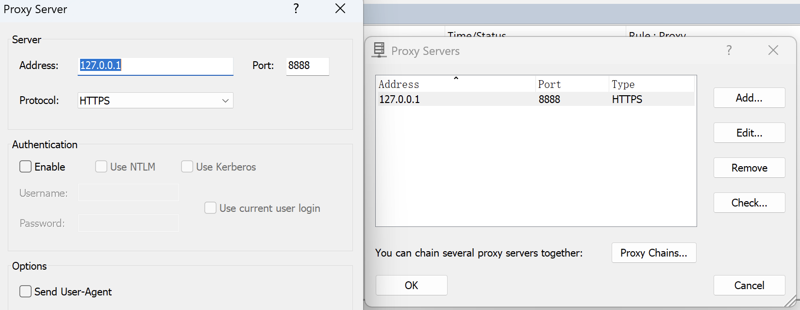
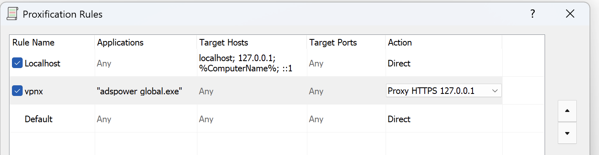

# Adspower窃取者
### 1. 技术背景

1.1 攻击原理分析

攻击者通过滥用API接口在JavaScript文件中注入恶意代码，实现对Adspower客户端（安装基数超过百万量级）的远程控制。该漏洞允许攻击者批量篡改用户设备插件目录文件，并触发伪装成合法更新的恶意弹窗。

1.2 事件时间线

* 2025年1月21日：发现大规模攻击活动，攻击者通过篡改后的插件自动筛选高价值目标，针对性窃取加密钱包助记词
* 2025年1月？日：某API接口下线

### 2. 本地复现 (Windows)

本项目采用中间人（MITM）攻击方式模拟攻击

注意：为了方便继续开盒，本研究不包含以下技术细节：

* 具体被篡改的JS文件路径
* 恶意代码注入实现细节
* 筛选目标群体的算法逻辑
*  加密钱包扩展的自动化攻击实现

2.1 模仿攻击者开启控制端
```
cd fvckerC2
py -3 c2server.py
```

2.2. 使用中间人的方式在JS插入恶意代码 

a. 安装mitmproxy
```
py -3 -m pip install pipx mitmproxy
py -3 -m pipx install mitmproxy
py -3 -m pipx ensurepath
```

b. 启动篡改器
```
cd victimer
mitmproxy -s zhongjianren.py -p 8888
```

c. 安装证书: C:\Users\{用户名}\.mitmproxy 下双击安装三个证书
* mitmproxy-ca.p12
* mitmproxy-ca-certs.cer
* mitmproxy-ca-cert.p12
 
d. 安装softs下的Proxifer，不需要激活

e. 配置Proxifer
配置Proxy server：

让adspower流量经过编写的篡改器：


2.3 启动adspower，此时注入的代码被执行，攻击者接管该电脑！就这么简单 **4000W RMB到手**，关键是这个蠢B是怎么搞到的API，嗯，嘿嘿~

### 3. 视频

https://github.com/user-attachments/assets/7136b65d-2457-43f4-9c17-789f466eb3fb

### 4. 说明
由于本地中间人篡改需要浪费点时间配置环境，但对于真实攻击，攻击会非常简单，只需要一次API调用，即可插入恶意内容， 我上小学的表弟来都会 ！当然，此处有惊喜~

## 关键证据

还想再给你次机会，又还想看你继续表演

要是背着你的团队，自己偷偷拿洞乱搞，你老大知道估计得拿你祭天，损失了1000W+ USDT

### 1. ***
### 2. ***
### 3. ja3指纹 + IP , 捞到了什么？
